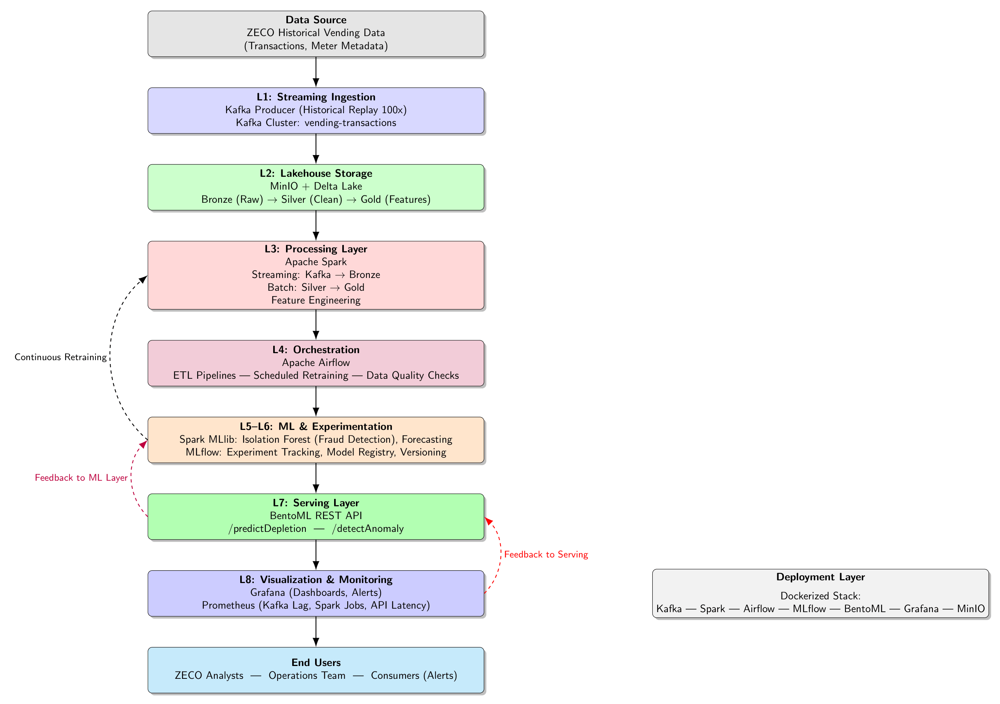
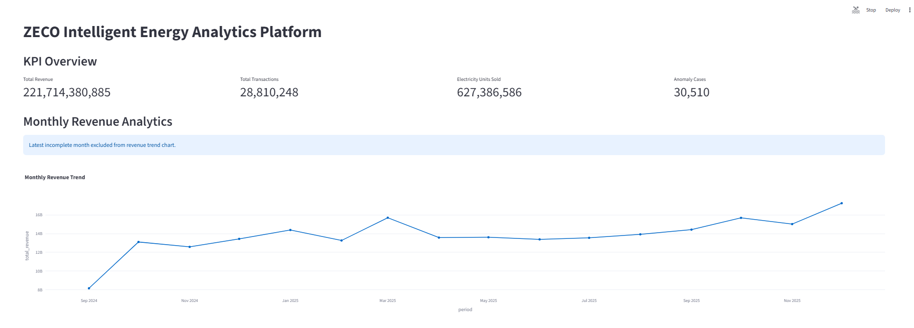
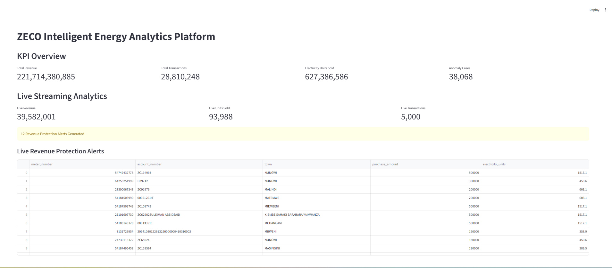
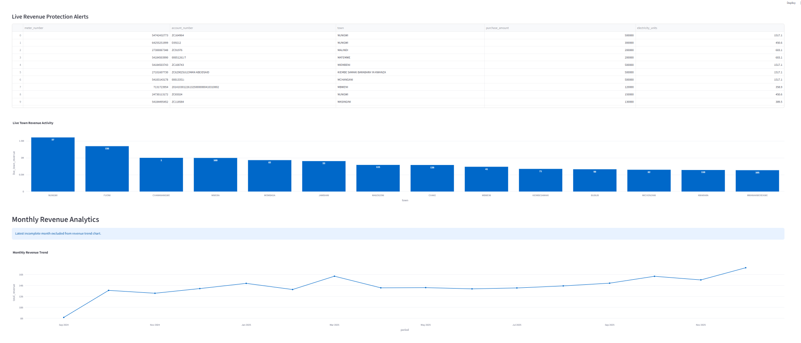
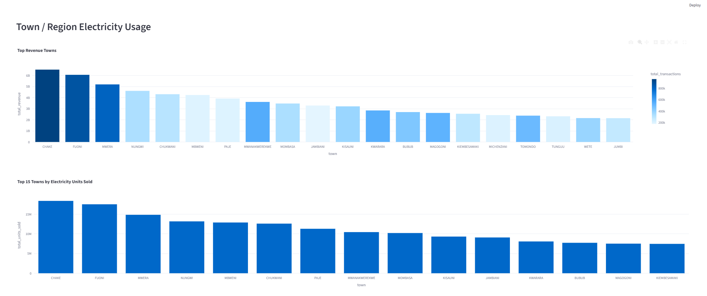
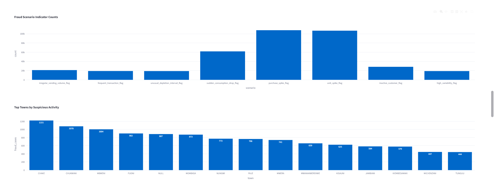
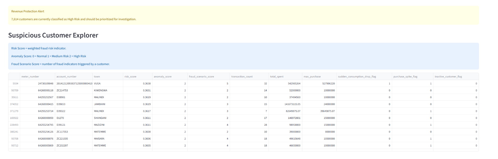
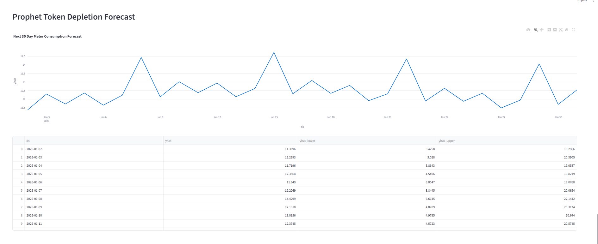

# ZECO Intelligent Energy Analytics Platform

## Architecture



## Features

- Real-Time Streaming Analytics
- Revenue Protection & Fraud Detection
- ARIMA Revenue Forecasting
- Prophet Token Forecasting
- Airflow Workflow Automation
- Spark Lakehouse Architecture
- Streamlit Business Dashboards

## Dashboard Screenshots

### KPI Dashboard



### Live Streaming Analytics



### Revenue Analytics



### Town Analytics



### Fraud & Anomaly Dashboard


### Fraud Indicators



### Suspicious Customer Explorer



### Prophet Forecast



## Machine Learning Components

### Revenue Protection

- Isolation Forest anomaly detection
- Risk scoring framework
- Fraud indicator generation
- Revenue-at-risk estimation

### Forecasting

- ARIMA Revenue Forecasting
- Prophet Token Depletion Forecasting

## Workflow Orchestration

Apache Airflow DAG:

```text
dags/zeco_pipeline_dag.py
```

Automated workflows:

1. Revenue Protection Anomaly Detection
2. ARIMA Forecast Generation
3. Prophet Forecast Generation
4. Gold Layer Analytics Refresh

## Documentation

Project reports are available in:

```text
docs/
├── Project Proposal
├── Progress Report
└── Dashboard Screenshots
```
